# Predicting Loan Interest Rates: Regression Trees vs Linear Models

When someone applies for a personal loan on Lending Club, the platform assigns them an interest rate based on how risky they look as a borrower. This project builds three models that predict what rate a borrower will receive, using 15 features about their financial background. The three models are a regression tree, a linear regression with best subset selection, and a LASSO regression. All three are trained on the same data and compared on the same held-out validation set.

The full write-up with all code is in [analysis.md](analysis.md).

---

## The Dataset

15,000 Lending Club loans with 15 features per borrower. The target variable is the interest rate assigned by the platform, which ranges from 6% to 26%.

Features include loan amount, loan term (36 or 60 months), employment length, home ownership status, income, debt-to-income ratio, FICO credit score, number of delinquencies in the past two years, credit history length, number of open accounts, revolving credit balance, and revolving credit utilization.

### Distribution of Interest Rates

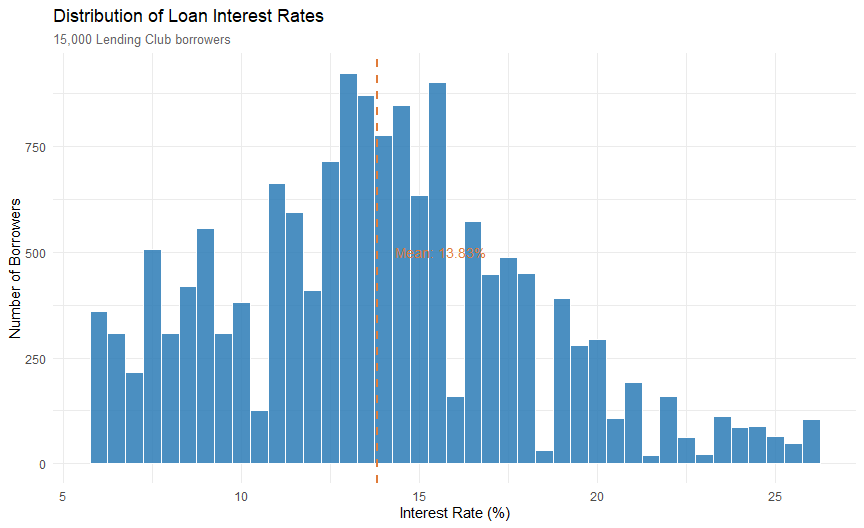

The average rate is about 13.8%, but there is a wide spread. Most borrowers fall between 8% and 18%, with a tail of higher-risk borrowers pushing up toward 26%. That 20 percentage point spread between the best and worst rates represents thousands of dollars in extra interest cost over the life of a loan. The right-skewed shape tells us that fewer borrowers receive very high rates, but those that do are paying significantly more.

### Key Drivers: FICO Score and Loan Term

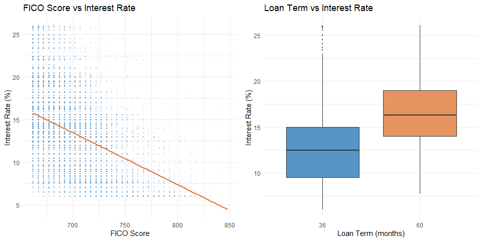

The two most important predictors are immediately visible. FICO score has a strong downward relationship with interest rate: every additional point on the credit score corresponds to a lower rate. Loan term shows a clear split: 60-month loans carry rates roughly 3 to 4 percentage points higher than 36-month loans, on average. A longer loan means more time for things to go wrong, and the platform prices that uncertainty into the rate.

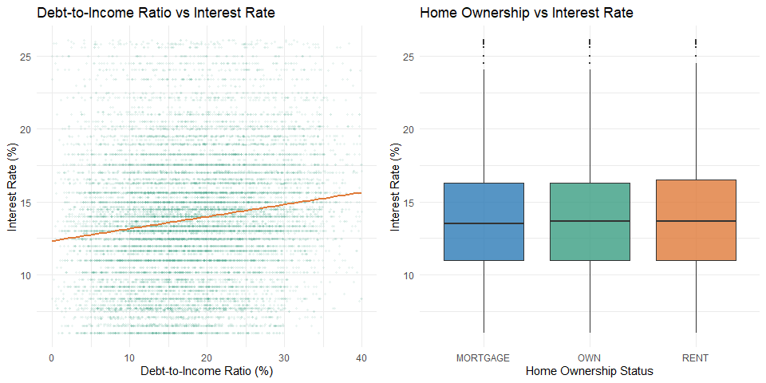

Debt-to-income ratio has a mild positive relationship with rate. Borrowers carrying more debt relative to their income get slightly higher rates, though the effect is weaker than FICO or loan term. Home ownership shows a clear ordering: outright homeowners get the best rates, mortgage holders are in the middle, and renters pay the most. Owning property outright is a strong signal of financial stability.

---

## Model 1: Regression Tree

A regression tree splits borrowers into groups based on their feature values, then predicts the average rate for everyone in each group. It is highly interpretable but can only make a limited number of distinct predictions, one per leaf node.

### Full Tree

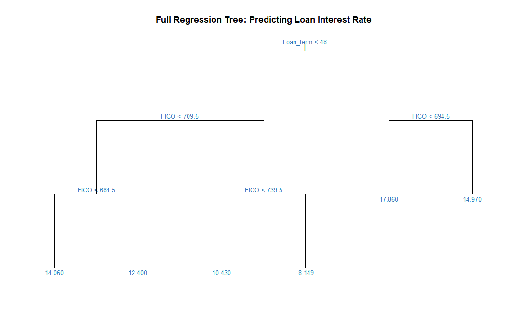

Out of 15 available features, the full tree uses only two: loan term and FICO score. This is a strong result. The tree finds that those two variables alone explain most of the variation in rates. Every other feature in the dataset adds little or nothing once you know those two things.

### Cross-Validation: Finding the Right Tree Size

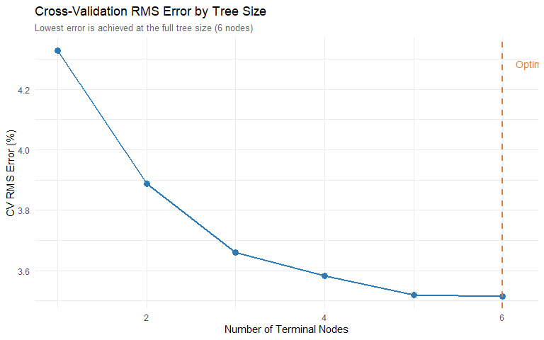

Cross-validation tests each possible tree size and measures prediction error on held-out portions of the training data. The error is lowest at 6 nodes, which is the full tree. Pruning would not improve performance here, so the full 6-node tree is used as the final model.

### Cleaner Tree Visualization

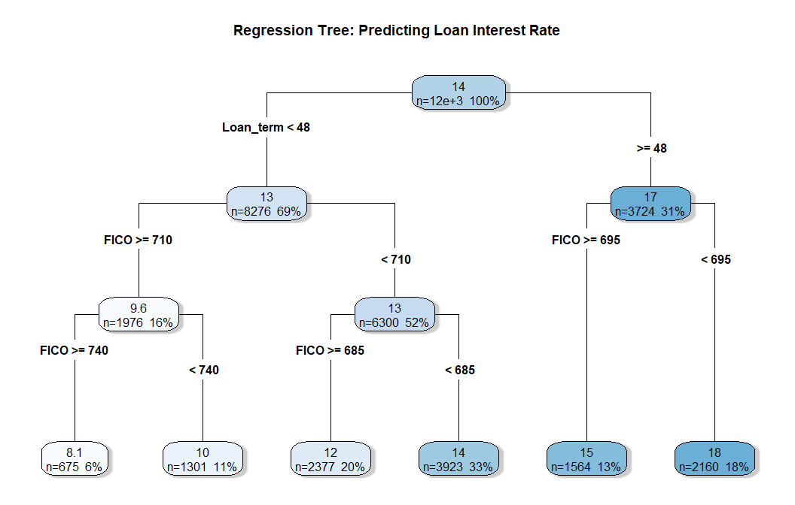

Reading the tree from top to bottom: the first split is on loan term. 36-month loans go left, 60-month loans go right. Within each side, FICO score determines the final bucket. The lowest predicted rate (~8.3%) goes to short-term borrowers with strong credit. The highest (~19.5%) goes to long-term borrowers with weak credit. The tree makes this prediction for every single borrower in a given leaf, regardless of any other differences between them.

### Tree Residuals

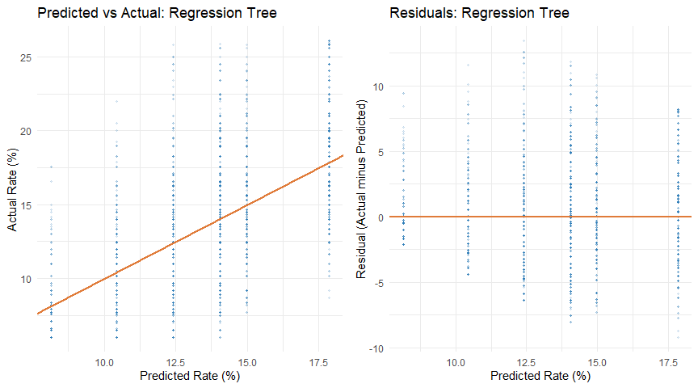

The predicted vs actual chart on the left makes the tree's limitation obvious. Because the tree only predicts 6 values, all predictions cluster into 6 vertical bands. Many borrowers with very different actual rates receive the exact same predicted rate. The residual plot on the right shows the result: large errors for borrowers whose actual rate falls far from the average of their leaf.

**Regression tree RMS error: 3.49%**

---

## Model 2: Linear Regression with Best Subset Selection

Best subset selection tries all possible combinations of features and finds the set that produces the best adjusted R-squared. Adjusted R-squared rewards explanatory power while penalizing unnecessary complexity.

### Choosing the Right Number of Variables

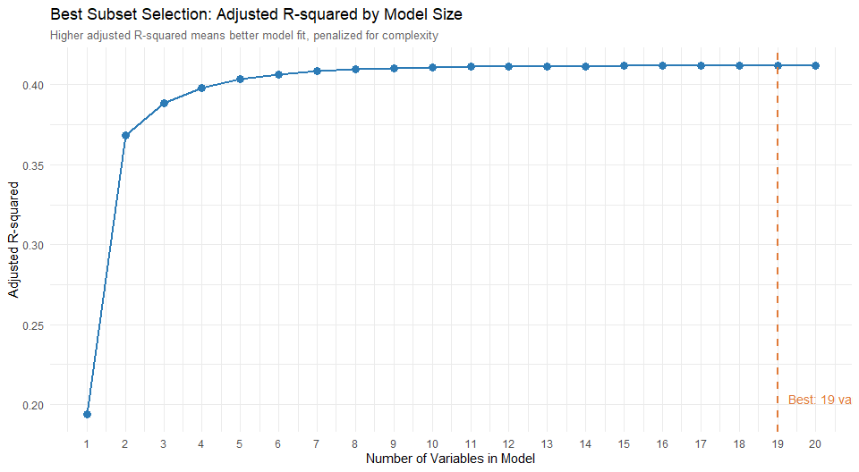

Adjusted R-squared rises quickly with the first few variables, then flattens. The dashed line marks where it peaks. Adding more variables beyond that point does not meaningfully improve the model and risks overfitting.

### Coefficient Estimates

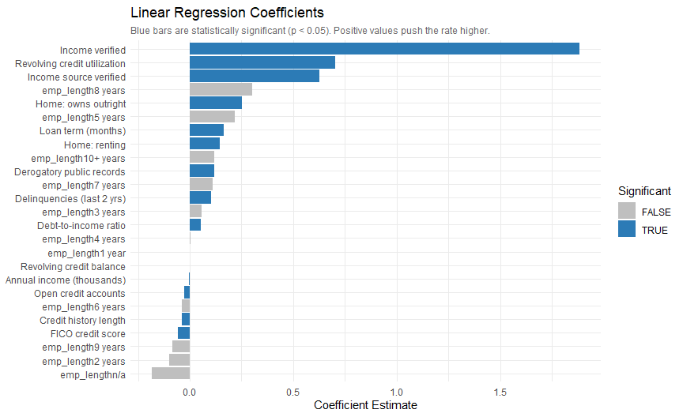

Blue bars are statistically significant predictors. The direction of each bar tells you how that variable affects the rate. Loan term has the largest positive coefficient: a longer loan substantially raises the predicted rate. FICO has the largest negative coefficient: a higher credit score substantially lowers it. Debt-to-income ratio, delinquencies, and revolving credit utilization all push the rate higher. Income pushes it lower. The model is, at its core, formalizing the same intuition the exploratory analysis showed.

### Linear Regression Residuals

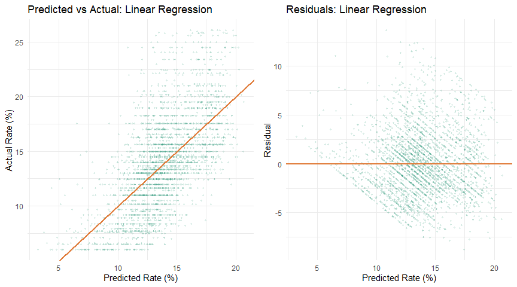

The predicted vs actual chart looks much tighter than the tree. Instead of clustering in bands, predictions spread across the full range of actual rates. The residual plot is close to the ideal: points scattered randomly around zero with no obvious pattern.

**Linear regression RMS error: 3.32%**

---

## Model 3: LASSO Regression

LASSO adds a penalty for including too many variables. As the penalty increases, it shrinks less important coefficients toward zero and eventually removes them from the model entirely. This handles feature selection automatically and tends to generalize well when some features are noisy.

### Finding the Best Penalty (Lambda)

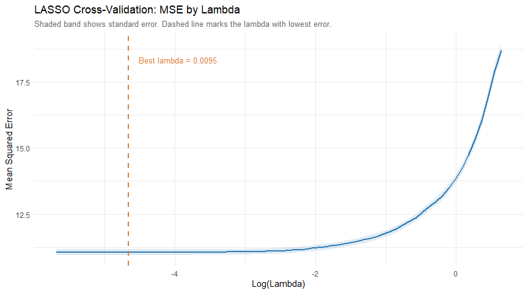

Each point on the curve is the cross-validated prediction error at a given penalty level. Moving right means more penalty and a simpler model. The dashed line marks the lambda that minimizes error. LASSO picks only the variables that survive at that penalty level.

### LASSO Coefficients

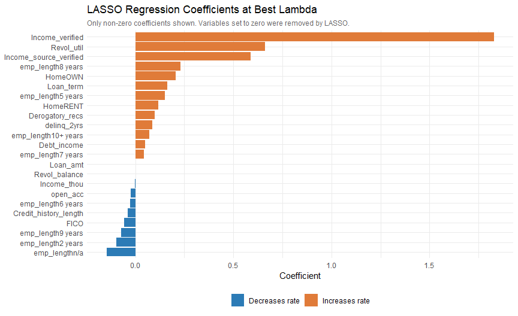

Orange bars increase the predicted rate, blue bars decrease it. Variables LASSO set to exactly zero are not shown because LASSO removed them from the model. The coefficient pattern is very similar to the linear regression, confirming that both methods are identifying the same underlying relationships in the data.

### LASSO Residuals

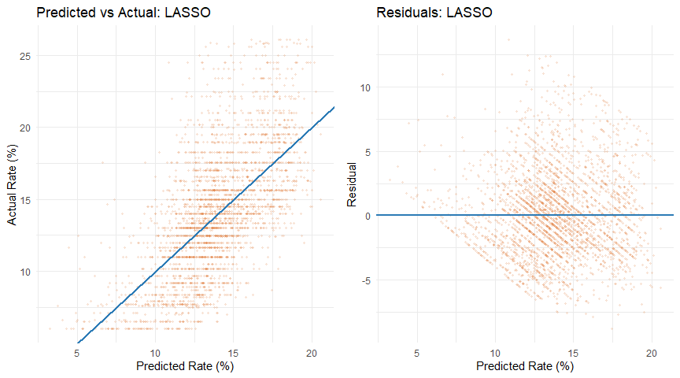

Very similar to linear regression. The predictions are continuous and spread across the full rate range, and the residuals show no systematic pattern.

**LASSO RMS error: 3.32%**

---

## Model Comparison

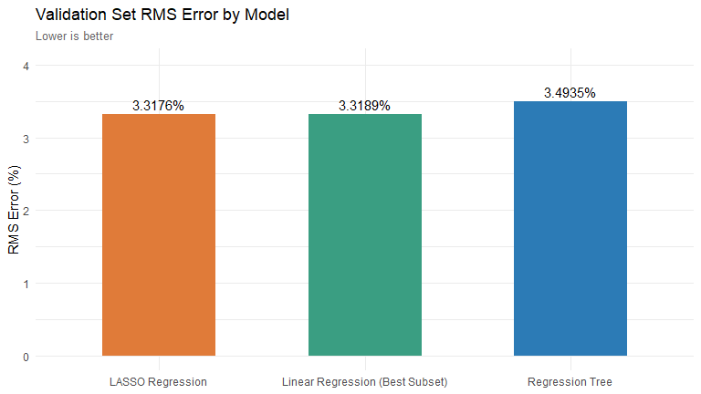

| Model | RMS Error | Notes |
|---|---|---|
| Regression Tree | 3.49% | Uses only 2 features, 6 leaf buckets |
| Linear Regression (Best Subset) | 3.32% | Selects best variable subset |
| LASSO Regression | 3.32% | Automatically penalizes weak predictors |

Linear regression and LASSO tie almost exactly. Both outperform the regression tree by about 0.17 percentage points in RMS error.

### Error Distribution Across All Three Models

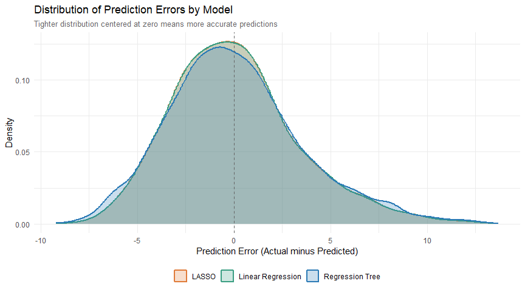

This chart overlays the distribution of prediction errors for all three models. The regression tree's error distribution has multiple spikes, a direct consequence of having only 6 possible predicted values. Any borrower whose actual rate falls between two leaf values will have a correspondingly large error. LASSO and linear regression produce smooth, bell-shaped error distributions centered near zero, which is the desired behavior.

---

## Key Findings

**FICO score and loan term drive everything.** The regression tree found this by ignoring all other variables. Linear regression and LASSO confirm it through their coefficient magnitudes. A borrower can improve their predicted rate more by improving their credit score than by any other single action.

**Linear models beat the tree here.** Interest rates follow a relatively smooth continuous function of FICO and loan term. Linear models are built for exactly this kind of relationship. The tree approximates it with a step function, which is less accurate.

**LASSO and linear regression perform identically.** With 15,000 observations and a strong clear signal, both methods converge on the same solution. LASSO's advantage over ordinary regression is more pronounced with smaller datasets or when many features are noisy.

**A 3.3% RMS error is meaningful, not trivial.** Over a 36-month loan of $15,000, a 3.3 percentage point error in the predicted rate corresponds to roughly $800 in additional interest. The models do well but cannot fully capture every factor Lending Club uses internally.

---

## Files

- [analysis.Rmd](analysis.Rmd) - source file, run this to reproduce everything
- [analysis.md](analysis.md) - full rendered output with all code, tables, and charts
- [Lending Club.csv](Lending%20Club.csv) - dataset (15,000 loans)

## How to Run

```r
install.packages(c("rmarkdown", "ggplot2", "gridExtra", "tree",
                   "rpart", "rpart.plot", "leaps", "glmnet"))
rmarkdown::render("analysis.Rmd", output_format = "github_document")
```
